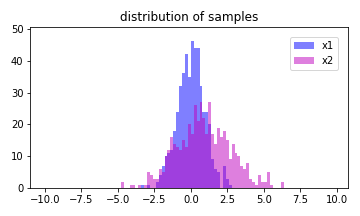
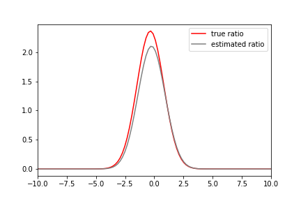

# A Python Package for Density Ratio Estimation by uLSIF.

## 1\. Overview
The densityratio package estimates the density ratio `r(x) = p(x) / q(x)` from two-samples `x1` and `x2` generated from two unknown distributions `p(x), q(x)`, respectively, where `x1` and `x2` are d-dimensional real numbers.   
The densityratio provides a *densratio()* class that returns an object with a function for estimating the density ratio and a method for getting the parameters of the density ratio estimation.   
See the [quick start](#3.-Quick-start) for detailed usage.

The estimated density ratio function `r(x)` can be used in many applications such as the covariate shift adaptation, outlier detection, and change point detection. See [related works](#6.-Related-Works).


## 2\. Installation

You can install the package from
[GitHub](https://github.com/JohnYKiyo/density_ratio_estimation)

``` :sh
$ pip install git+https://github.com/JohnYKiyo/density_ratio_estimation.git
```

### Dependencies   
densityratio requires:

- Python (>= 3.6)   
- Jax (>=0.1.57)   
- Jaxlib (>=0.1.37)   
- Ipython (>=7.12.0)


## 3. Quick start 

### 3.1 simple usage
Generate two samples that follow the normal distribution of $\mathcal{N(0,1)}$ and $\mathcal{N(1,2)}$, respectively.   
   
The code below gives the above output:

```sh
import densityratio
import numpy as np
import scipy.stats
import matplotlib.pyplot as plt
m = [0.,1]
s = [1.0,2.0]
np.random.seed(10)
x1 = np.random.normal(loc= m[0], scale = s[0], size = 500)
x2 = np.random.normal(loc= m[1], scale = s[1], size = 500)

fig = plt.figure(figsize=[5,3])
ax = fig.add_subplot(111)
ax.set_title('distribution of samples')
edges = np.arange(-10,10,0.2)
a = ax.hist(x1, bins = edges, color='b', alpha = 0.5, label='x1')
b = ax.hist(x2, bins = edges, color='m', alpha = 0.5, label='x2')
ylim = 1.1*np.max([a[0],b[0]])
ax.set_ylim(0,ylim)
ax.legend(fontsize = 10, bbox_to_anchor = (1,1), loc='upper right', borderaxespad = 1)
plt.tight_layout()
fig.savefig('pic/QS1_samples.png')
```

Pass two samples to the densratio and it will be calculated automatically.
```sh
dens = densityratio.densratio(x1,x2)
```
In this case, the true density ratio $r(x)$ is known, so we can compare $r(x)$ with the estimated density ratio $\hat{r}(x)$.    
   
The code below gives the above output:   
```sh
x = np.linspace(-10,10,100)
x1_pdf = lambda x: scipy.stats.norm.pdf(x,loc=m[0],scale=s[0])
x2_pdf = lambda x: scipy.stats.norm.pdf(x,loc=m[1],scale=s[1])
r = lambda x: x1_pdf(x)/x2_pdf(x)

plt.figure()
plt.plot(x,r(x),'r',label='true ratio')
plt.plot(x,dens(x),'gray',label='estimated ratio')
plt.xlim(-10,10)
plt.legend()
plt.savefig('pic/QS1_ratio.png')
```

Here is this [notebook](QuickStart1.ipynb)

### 3.2 


## 4. Algorithm of Direct density ratio estimation.
See [here](Algorithm.pdf)

## 5. References

\[1\] M. Suigyama et al., **Direct Importance Estimation with Model Selection and Its Application to Covariate Shift Adaptation,** Proc. 20th Int. Conf. Neural Inf. Process. Syst., 2007.

\[2\] T. Kanamori, S. Hido, and M. Sugiyama, **A least-squares approach to direct importance estimation,** J. Mach. Learn. Res., vol. 10, pp. 1391–1445, 2009.

\[3\] T. Kanamori, T. Suzuki, and M. Sugiyama, **Condition number analysis of kernel-based density ratio estimation**.,[arXiv](https://arxiv.org/abs/0912.2800)., (2009).

\[4\] S. Hido, Y. Tsuboi, H. Kashima, M. Sugiyama, and T. Kanamori, **Statistical outlier detection using direct density ratio estimation,** Knowl. Inf. Syst., vol. 26, no. 2, pp. 309–336, 2011.

\[5\] M. Sugiyama, T. Suzuki, and T. Kanamori, **Density Ratio Estimation in Machine Learning.** Cambridge University Press 2012.

\[6\] S. Liu, M. Yamada, N. Collier, and M. Sugiyama, **Change-point detection in time-series data by relative density-ratio estimation,** Neural Networks, 2013.

\[7\] M. Yamada, T. Suzuki, T. Kanamori, H. Hachiya, and M. Sugiyama, **Relative density-ratio estimation for robust distribution comparison,** Neural Computation. 2013.


## 6. Related Works
- uLSIF for MATLAB R C++ <http://www.ms.k.u-tokyo.ac.jp/software.html>
- RuLSIF for MATLAB <https://riken-yamada.github.io/RuLSIF.html>

    ## Covariate shift
    - M. Sugiyama, M. Krauledat, and K. R. Müller, **Covariate shift adaptation by importance weighted cross validation,** J. Mach. Learn. Res., 2007.

    - H. Shimodaira, **Improving predictive inference under covariate shift by weighting the log-likelihood function,** J. Stat. Plan. Inference, 2000.

    ### Outlier detection
    - S. Hido, Y. Tsuboi, H. Kashima, M. Sugiyama, and T. Kanamori, **Statistical outlier detection using direct density ratio estimation,** Knowl. Inf. Syst., vol. 26, no. 2, pp. 309–336, 2011.

    - H. Nam and M. Sugiyama, **Direct density ratio estimation with convolutional neural networks with application in outlier detection,** IEICE Trans. Inf. Syst., 2015.

    - M. C. du Plessis, H. Shiino, and M. Sugiyama, **Online direct density-ratio estimation applied to inlier-based outlier detection,** Neural Computation. 2015.

    ### Change point detection
    - Y. Kawahara and M. Sugiyama, **Sequential change-point detection based on direct density-ratio estimation,** Stat. Anal. Data Min., 2012.

    - S. Liu, M. Yamada, N. Collier, and M. Sugiyama, **Change-point detection in time-series data by relative density-ratio estimation,** Neural Networks, 2013.

    - M. Yamada, A. Kimura, F. Naya, and H. Sawada, **Change-point detection with feature selection in high-dimensional time-series data,** in IJCAI International Joint Conference on Artificial Intelligence, 2013.